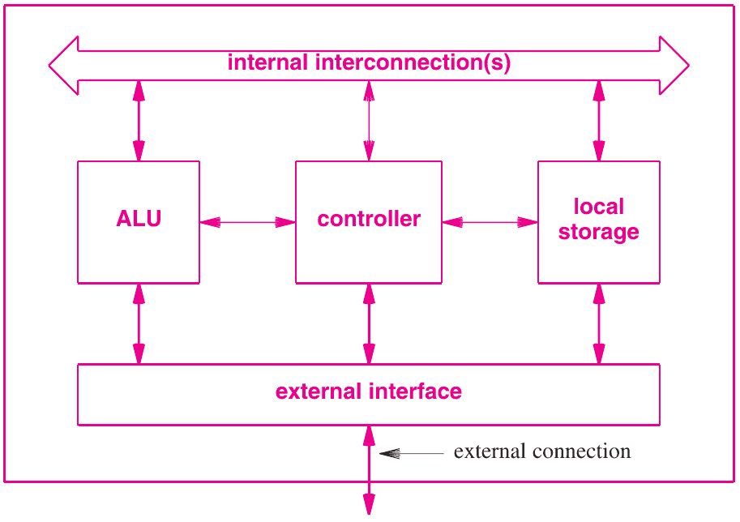

- Lab questions?

4 Processors
============

Von Neumann Architecture
------------------------

- Architecture used by almost all modern computers
- A *stored program* resides in memory and is executed by a *processor*

Components
----------

- A processing unit with ALU and registers
- A control unit with program counter and instruction register
- Memory storing instructions and data
- Input and output mechanisms

---

---

[Computerphile video](https://www.youtube.com/watch?v=Ml3-kVYLNr8)

Processor
---------

- Digital device that performs computation involving multiple steps
- Not complete computers
- Core building block of a computer
- Can be very basic or very complex

Processor Types
---------------

- Fixed logic
- Selectable logic
- Parameterized logic
- Programmable logic

Fixed Logic
-----------

- Can only perform one sequence of operations
- Fixed graphics pipeline
- Sound system
- JPEG compression

Selectable Logic
----------------

- Can perform one of several sequences of operations
- Operations are defined at the time the processor is manufactured

Parameterized Logic
-------------------

- Computes pre-determined functions
- Provides additional parameters that adjust behavior
- JPEG compressor with tunable quality

Programmable Logic
------------------

- Instructions are read from memory and can be adjusted to run a multitude of operations

Hierarchical Structure
----------------------

- Modern CPUs are extremely complex
- We break them into subsystems to better understand them
- We may refer to different components as engines

Central Units
-------------

- Controller
- Computational engine (ALU)
- Local data storage
- Internal connections
- External interface

---

{height=540px}

Controller
----------

- Steps through program
- Coordinates actions

Computational Engine
--------------------

- Executes operations
- `add`, `subtract`, `xor`, `aes`, `dct`, etc

Local Data Storage
------------------

- Used to store results of computations
- Modern CPUs use registers for this purpose

Internal connections
--------------------

- Connects other components together
- Also known as data path

External Interface
------------------

- Communicates with external devices
- Read/writes to main memory
- Performs I/O

Arithmetic Logic Unit
---------------------

- ALU
- Executes arithmetic and logical operations
- Complex unit that can handle a variety of operations

Processor Roles
---------------

- Coprocessor
- Microcontroller
- Microsequencer
- Embedded system processor
- General purpose

Fetch Execute Cycle
-------------------

- Fetch instruction
- Execute it
- Repeat

Bootstrapping
-------------

- CPU must always have instructions to run
- Initial instructions typically come from read-only memory (ROM)

Clock Rate
----------

- A clock is used to govern the execution rate of the CPU and underlying components
- Individual instructions may take differing numbers of cycles (e.g. memory operations take longer than ALU operations)
