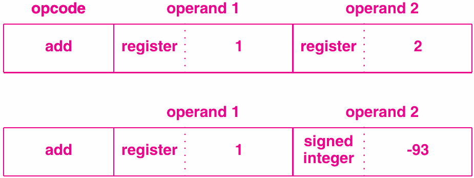
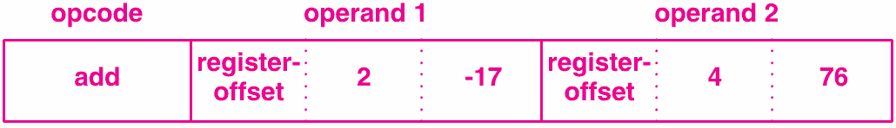
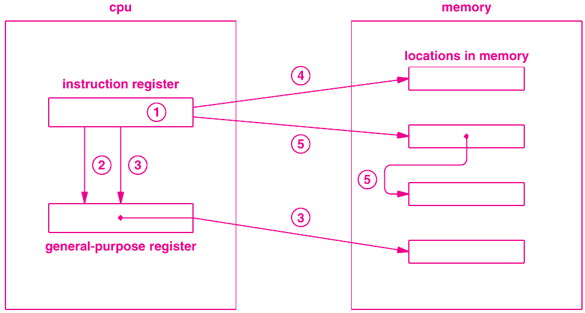

- Lab questions?
- Exam Friday

6 Operand Addressing and Instruction Representation
===================================================

Operands Per Instruction
------------------------

- Halt requires none
- Bitwise `not` requires one
- Add requires two
- We can include an extra for the result destination

Zero Address Architectures
--------------------------

- Instructions include no address operands
- Operands are determined implicitly
- Values may be stored on a stack

---

```
push x
push 7
add
pop x
```

Stack machine example to add 7 to x

One Address Architectures
-------------------------

- Instructions include a single operand
- Intermediate values are stored in an intermediate register called an accumulator
- Require two instructions for certain operations (e.g. copy)

---

```
store x
addi 7
fetch x
```

Accumulator example

Two Address Architectures
-------------------------

- Instructions include two operands
- Most operations map to a single instruction
- Addresses may be thought of as `src` and `dst` for many instructions

Three Address Architectures
---------------------------

- Instructions include three operands
- Allows storing results without clobbering registers

Operand Values
--------------

- Register values
- Memory values
- Signed and unsigned constants

Von Neumann Bottleneck
----------------------

- Data and instructions are both in memory
- An instruction that accesses data memory must actually access memory twice
- This can be mitigated partially by having many registers

Operand Encoding
----------------

- We may want to support the same operation but with different operand meanings
- `add R0 R1` where R0 and R1 contain values to add
- `add R0 R1` where R0 and R1 contain pointers to memory locations to add

Implicit Operand Encoding
-------------------------

- A given opcode only accepts a specific type of operand
- `add_reg`
- `add_mem`
- `add_imm`

Explicit Operand Encoding
-------------------------

- Include types in instructions

---



Combining Values
----------------

- It can be useful to implement more complex operand values
- We may want to adjust a register by an offset (perhaps to access a member of a struct or array)

---



Trade offs
---------

- Ease of programming
- Fewer instructions
- Smaller instructions
- Larger immediate values
- Faster fetch and decode
- Simpler hardware

Memory
------

- Registers are fast and few in number
- Memory is slow and relatively massive

Memory Access
-------------

- Provide an explicit instruction (`load`)
- Allow indirection through registers

Indirect Reference
------------------

- An instruction uses a value from memory by
    1. Loading a location of the value from the specified register
    2. Fetching the value from the memory location

Addressing Modes
----------------

1. Immediate value
2. Direct register reference
3. Indirect through register
4. Direct memory reference
5. Indirect memory reference

---


