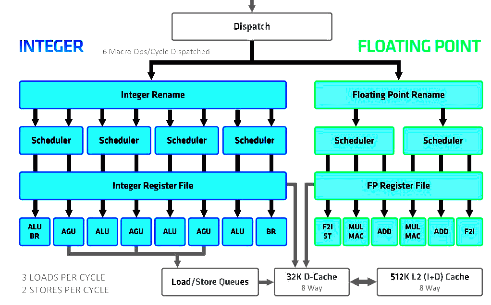

7 CPUs: Microcode, Protection, Modes
====================================

Central processors
------------------

- Modern computers are distributed systems with many processors
- CPU, GPU, sound, wifi, cellular, etc
- A "central" processor can be thought of as orchestrating the others

CPU roles
---------

- Running applications
- Running OS
- Handling I/O
- Powering devices (including the whole computer) on and off

Protection and Privilege
------------------------

- Application programs need very limited access
- Certain parts of the operating system need unlimited access

Processor Modes
---------------

- Change how instructions are handled
- Some instructions may be unavailable
- Some memory ranges may be unavailable
- Other privileges may be adjusted

Backwards Compatibility
-----------------------

- Processor modes can be used to allow new hardware to behave like old hardware
- Intel CPUs include compatibility mode in 32-bit CPUs to allow them to behave like their older 16-bit CPUs

Changing Modes
--------------

- Automatic - initiated by hardware
- Manual - initiated by instructions

Device I/O
----------

- Hardware may interrupt the processor
- This will move control flow to a new location and likely adjust the processor mode

Operating System
----------------

- The OS needs full control of the system, so it will change modes as needed
- User programs should not have full control, so they operate in a restricted mode they cannot change

Mode register
-------------

- A special purpose register may be used to store the current mode

Privilege Levels
-----------------

- How many privilege levels should we have?
- We need at least 2 in order to isolate application programs from the OS

---


Microcode
=========

Complex instruction sets
------------------------

- How do we implement complex instruction sets in hardware?

Microcode
---------

- An intermediary layer between CPU hardware and the programmer-visible machine code
- We can convert complex instructions into simpler instructions run directly by the CPU

Array access example
--------------------

```c
char* get_nth(char ** arr, long int n) {
  return arr[n];
}

void _start() {
  char * arr[2] = {"Hello ", "world!"};

  write(1, get_nth(arr, 0), 7);
  write(1, get_nth(arr, 1), 7);
  exit(0);
}
```

x64 Assembly
------------

```asm
get_nth:
	movq	(%rdi,%rsi,8), %rax
	ret
```

movq
----

- Moves a quad word (64-bit) value to a register
- x64 addressing modes add complexity
- In this case, we are moving the value stored at:
    -  rdi + rsi*8

Microcode Generation
--------------------

CISC

```asm
movq	(%rdi,%rsi,8), %rax
```

Microcode

```asm
mul  %rsi,  8,    %tmp1
add  %tmp1, %rdi, %tmp2
load %tmp2, %rax
```

Advantages
----------

- Simplifies testing and development
- Microcode generation can be patched to fix hardware problems

Parallel Execution
------------------

- We can run multiple microcode instructions (micro-ops) simultaneously to make better use of available hardware
- We can add more processing engines to run more micro-ops in parallel

---

{height=540px}

Scheduling
----------

- Determining what to run next becomes a complex problem
- Data dependencies and branches must be considered

Out-of-order Execution
----------------------

- Instructions can be run in different order than they come in
- Results must be the same

---



Conditional Branches
--------------------

- Create additional challenges for out-of-order execution
- Branch prediction is used to improve performance
