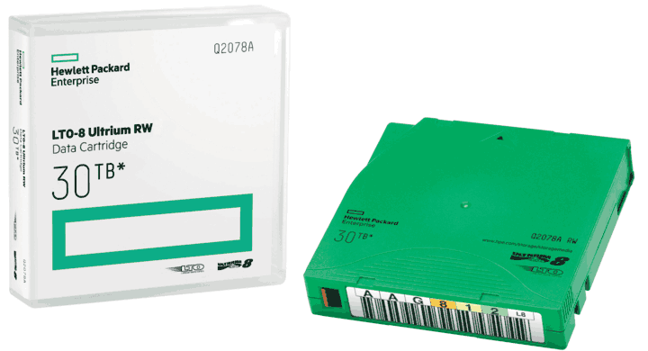

Lab questions?

9 Memory and Storage
====================

CPUs
----

- Execute instructions
- Have access to a limited number of registers to store data

Memory
------

- Used to store programs and data
- Any solid-state device that provides storage

Technology
----------

- Architects may select from a host of available technologies to store data
- Examples include DRAM and flash memories

---

Organization
------------

- Regardless of technology chosen, architects also determine how memory should be organized
- Organization determines how the technology is put together to form a working system

Memory Characteristics
----------------------

- Volatile or nonvolatile
- Random or sequential
- Read-write or read-only
- Primary or secondary

Volatile
--------

- Memory contents disappear without power
- Main memory is typically volatile

Non-volatile
------------

- Memory contents persist without power
- Long term data storage is frequently non-volatile

Memory Access
-------------

- **Random access** allows any value to be accessed at any time
- **Sequential access** reads values in the order they were inserted (FIFO)
- A tape drive is an example of a sequential access memory

---

---

Permanence
----------

- Some memories allow values to be updated, others do not
- Read-only Memory (ROM) can only be read
- Some memories are erasable, but can't be updated randomly

---

Memory Hierarchy
---------------

- Economic factors lead systems to include multiple memories
- Faster memories are usually more expensive
- Larger memories are usually more expensive
- Speed and size are both ultimately limited by physics

---

{height=540px}

---

[Interactive Latency over Time](https://colin-scott.github.io/personal_website/research/interactive_latency.html)

---

Instruction and Data Memory
---------------------------

- Instructions and data are generally stored together (Von Neumann architecture)
- They may sometimes be separated for performance or architecture reasons, such as storing initial instructions in ROM and caching instructions and data separately

Fetch and Store
---------------

- Memories support 2 basic operations
- Fetch - read a value from memory
- Store - write a value to memory
